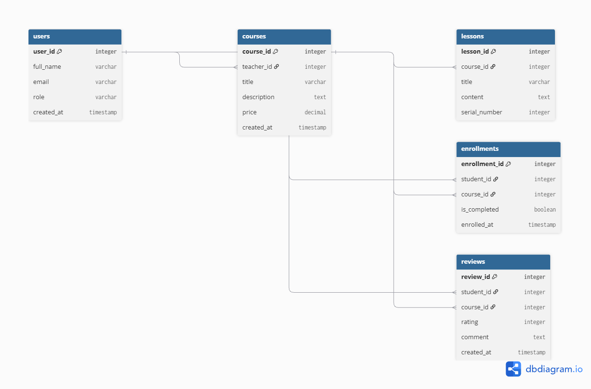
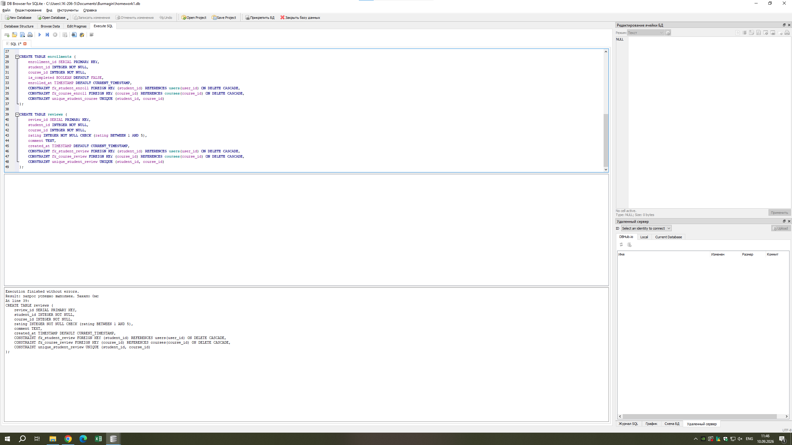

# Проект базы данных для EdTech-платформы (Домашняя работа №1)

**Выполнил:** Бурмагин Олег ДЭ 17-25

Репозиторий содержит материалы для выполнения домашнего задания по проектированию и реализации базы данных для онлайн-школы (EdTech-домен).

---

## 1. Концептуальная модель (Задание 1)
Разработана концептуальная схема базы данных для онлайн-платформы обучения. Основные выделенные сущности:
* **Пользователи (`users`)** — студенты, преподаватели и администраторы системы.
* **Курсы (`courses`)** — образовательные программы, создаваемые преподавателями.
* **Уроки (`lessons`)** — учебные материалы и лекции, входящие в состав курсов.
* **Записи на курсы (`enrollments`)** — таблица связи студентов с курсами, отражающая процесс обучения.
* **Отзывы (`reviews`)** — оценки и комментарии студентов к пройденным курсам.

---

## 2. Логическая модель и ER-диаграмма (Задание 2)
Визуализация структуры базы данных:

---

## 3. Реализация базы данных в SQLite (Задание 3)
База данных создана и управляется с помощью **DB Browser for SQLite**. Все таблицы созданы с соблюдением типов данных, внешних ключей (`FOREIGN KEY`) и ограничений целостности (`CHECK`, `UNIQUE`, `DEFAULT`).

* **SQL-скрипт создания структуры:** [`script.sql`](./script.sql)
* **Подтверждение успешного выполнения запросов:**

---

## 4. Частые запросы к базе данных (Задание 4)
Для платформы спроектированы следующие типовые сценарии запросов:
1. Получение списка всех активных курсов с указанием ФИО преподавателя и стоимости.
2. Вывод расписания уроков для конкретного курса, отсортированных по порядковому номеру (`serial_number`).
3. Проверка статуса прохождения курсов конкретным студентом (история записей и флаг завершения `is_completed`).
4. Подсчет средней оценки каждого курса на основе оставленных отзывов студентов.
5. Вывод списка всех студентов, записанных на определенный курс, для контроля успеваемости.
